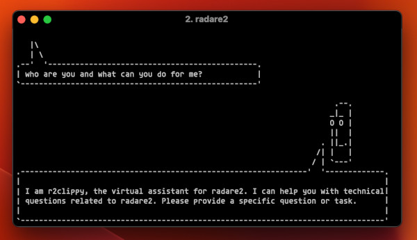

```
,______  .______ .______  ,___
: __   \ \____  |:      \ : __|
|  \____|/  ____||  _,_  || : |
|   :  \ \   .  ||   :   ||   |
|   |___\ \__:__||___|   ||   |
|___|        :       |___||___|
             *
```

[](https://github.com/radareorg/r2ai/actions/workflows/ci.yml)

Run a language model to entertain you or help answering questions about radare2 or reverse engineering in general. The language model may be local (running without Internet on your host) or remote (e.g if you have an API key). Note that models used by r2ai are pulled from external sources which may behave different or respond unreliable information. That's why there's an ongoing effort into improving the post-finetuning using memgpt-like techniques which can't get better without your help!

<p align="center">
  
</p>

## Components

R2AI is structured into four independent components:

* r2ai (wip r2ai-native rewrite in C)
  * r2-like repl using r2pipe to comunicate with r2
  * supports auto solving mode
  * client and server openapi protocol
  * download and manage models from huggingface
* decai
  * lightweight r2js plugin
  * focus on decompilation
  * talks to r2ai, r2ai-server, openai, anthropic or ollama
* *r2ai-plugin*
  * **not recommended because of python versions pain**. Hopefully soon re-written in C.
  * requires r2lang-python
  * adds r2ai command inside r2
* r2ai-server
  * list and select models downloaded from r2ai
  * simple cli tool to start local openapi webservers
  * supports llamafile, llamacpp, r2ai-w and kobaldcpp

## Features

* Support Auto mode (see below) to solve tasks using function calling
* Use local and remote language models (llama, ollama, openai, anthropic, ..)
* Support OpenAI, Anthropic, Bedrock
* Index large codebases or markdown books using a vector database
* Slurp file and perform actions on that
* Embed the output of an r2 command and resolve questions on the given data
* Define different system-level assistant role
* Set environment variables to provide context to the language model
* Live with repl and batch mode from cli or r2 prompt
* Accessible as an r2lang-python plugin, keeps session state inside radare2
* Scriptable from python, bash, r2pipe, and javascript (r2papi)
* Use different models, dynamically adjust query template
  * Load multiple models and make them talk between them

## Installation

### From r2pm

Install the various components via `r2pm`:

- `r2pm -ci r2ai`
- `r2pm -ci decai`
- `r2pm -ci r2ai-server`

### From sources

Running `make` will setup a python virtual environment in the current directory installing all the necessary dependencies and will get into a shell to run r2ai.

The installation is now splitted into two different targets:

* `make install` will place a symlink in `$BINDIR/r2ai`
* `make install-decai` will install the decai r2js decompiler plugin
* `make install-server` will install the decai r2js decompiler plugin

### Windows

On Windows you may follow the same instructions, just ensure you have the right python environment ready and create the venv to use

```cmd
git clone https://github.com/radareorg/r2ai
cd r2ai
set PATH=C:\Users\YOURUSERNAME\Local\Programs\Python\Python39\;%PATH%
python3 -m pip install .
python3 main.py
```

## Running r2ai

Launch r2ai:

- If you installed via r2pm, you can execute it like this: `r2pm -r r2ai`
- Otherwise, `./r2ai.sh`

Selecting the model:

- List all downloaded models: `-m`
- Get a short list of models: `-MM`
- Help: `-h`

**Example using Claude 3.5 Sonnet 20241022:**

First, put your API key in `~/.r2ai.anthropic-key`:

```
$ cat ~/.r2ai.anthropic-key 
sk-ant-api03-CENSORED
```

Then, launch r2ai, select a model and ask questions to the AI:

```
[r2ai:0x00006aa0]> -m anthropic:claude-3-5-sonnet-20241022
[r2ai:0x00006aa0]> compute 4+5
4 + 5 = 9
```

**Example using ChatGPT 4**

Put your API key in `~/.r2ai.openai-key`. Then, launch r2ai, select the model and question the AI:

```
[r2ai:0x00006aa0]> -m openai:gpt-4
[r2ai:0x00006aa0]> draw me a pancake in ASCII art
Sure, here's a simple ASCII pancake:

  _____  
 (     )
 (     )
  -----
```

**Example using a free local AI: Mistral 7B v0.2**

Launch r2ai, select the model and ask a question. If the model isn't downloaded yet, r2ai will ask you which precise version to download.

```
[r2ai:0x00006aa0]> -m TheBloke/Mistral-7B-Instruct-v0.2-GGUF
[r2ai:0x00006aa0]> give me a short algorithm to test prime numbers
Select TheBloke/Mistral-7B-Instruct-v0.2-GGUF model. See -M and -m flags
[?] Quality (smaller is faster): 
 > Small | Size: 2.9 GB, Estimated RAM usage: 5.4 GB
   Medium | Size: 3.9 GB, Estimated RAM usage: 6.4 GB
   Large | Size: 7.2 GB, Estimated RAM usage: 9.7 GB
   See More

[?] Quality (smaller is faster): 
 > mistral-7b-instruct-v0.2.Q2_K.gguf | Size: 2.9 GB, Estimated RAM usage: 5.4 GB
   mistral-7b-instruct-v0.2.Q3_K_L.gguf | Size: 3.6 GB, Estimated RAM usage: 6.1 GB
   mistral-7b-instruct-v0.2.Q3_K_M.gguf | Size: 3.3 GB, Estimated RAM usage: 5.8 GB
   mistral-7b-instruct-v0.2.Q3_K_S.gguf | Size: 2.9 GB, Estimated RAM usage: 5.4 GB
   mistral-7b-instruct-v0.2.Q4_0.gguf | Size: 3.8 GB, Estimated RAM usage: 6.3 GB
   mistral-7b-instruct-v0.2.Q4_K_M.gguf | Size: 4.1 GB, Estimated RAM usage: 6.6 GB
   mistral-7b-instruct-v0.2.Q4_K_S.gguf | Size: 3.9 GB, Estimated RAM usage: 6.4 GB
   mistral-7b-instruct-v0.2.Q5_0.gguf | Size: 4.7 GB, Estimated RAM usage: 7.2 GB
   mistral-7b-instruct-v0.2.Q5_K_M.gguf | Size: 4.8 GB, Estimated RAM usage: 7.3 GB
   mistral-7b-instruct-v0.2.Q5_K_S.gguf | Size: 4.7 GB, Estimated RAM usage: 7.2 GB
   mistral-7b-instruct-v0.2.Q6_K.gguf | Size: 5.5 GB, Estimated RAM usage: 8.0 GB
   mistral-7b-instruct-v0.2.Q8_0.gguf | Size: 7.2 GB, Estimated RAM usage: 9.7 GB

[?] Use this model by default? ~/.r2ai.model: 
 > Yes
   No

[?] Download to ~/.local/share/r2ai/models? (Y/n): Y

  Here's a simple algorithm to test if a number is likely prime using the trial division method, which checks if a    
  number is divisible by smaller prime numbers up to its square root:                                                 
                                                                                                                      
  1. Input the number `n` to be checked.                                                                              
  2. If `n` is less than 2, it is not a prime number.                                                                 
  3. If `n` is equal to 2, it is a prime number.                                                                      
  4. If `n` is even, it is not a prime number (unless it is equal to 2).                                              
  5. For each prime number `p` from 3 to the square root of `n`, do the following:                                    
     a. If `n` is divisible by `p`, it is not a prime number.                                                         
     b. If `n` is not divisible by `p`, go to the next prime number.                                                  
  6. If the loop completes without finding a divisor, then `n` is a prime number.                                     
                                                                                                                      
  This algorithm is not foolproof, as it can only determine if a number is likely prime, not definitely prime. For    
  example, it cannot determine if 15 is a prime number, but it can determine that 29 is a prime number. For larger    
  numbers, more sophisticated algorithms like the Miller-Rabin primality test or the AKS primality test are           
  required.              
```


## Running r2ai-server

- Get usage: `r2pm -r r2ai-server`
- List available servers: `r2pm -r r2ai-server -l`
- List available models: `r2pm -r r2ai-server -m`

On Linux, models are stored in `~/.r2ai.models/`. File `~/.r2ai.model` lists the default model and other models.

**Example launching a local Mistral AI server:**

```
$ r2pm -r r2ai-server -l r2ai -m mistral-7b-instruct-v0.2.Q2_K
[12/13/24 10:35:22] INFO     r2ai.server - INFO - [R2AI] Serving at port 8080                               web.py:336
```

## Running decai

Decai is used from `r2`. Get help with `decai -h`:

```
[0x00406cac]> decai -h
Usage: decai (-h) ...
 decai -H         - help setting up r2ai
 decai -d [f1 ..] - decompile given functions
 decai -dr        - decompile function and its called ones (recursive)
 decai -dd [..]   - same as above, but ignoring cache
 decai -D [query] - decompile current function with given extra query
 decai -e         - display and change eval config vars
 decai -h         - show this help
 decai -i [f] [q] - include given file and query
 decai -n         - suggest better function name
 decai -q [text]  - query language model with given text
 decai -Q [text]  - query on top of the last output
 decai -r         - change role prompt (same as: decai -e prompt)
 decai -s         - function signature
 decai -v         - show local variables
 decai -V         - find vulnerabilities
 decai -x         - eXplain current function
```

List configuration variables with `decai -e`:

```
[0x00406cac]> decai -e
decai -e api=r2
decai -e host=http://localhost
decai -e port=8080
decai -e prompt=Rewrite this function and respond ONLY with code, NO explanations, NO markdown, Change 'goto' into if/else/for/while, Simplify as much as possible, use better variable names, take function arguments and and strings from comments like 'string:'
decai -e ctxfile=
decai -e cmds=pdc
decai -e cache=false
decai -e lang=C
decai -e hlang=English
decai -e debug=false
decai -e model=
```

List possible APIs to discuss with AI: `decai -e api=?`:

```
[0x00406cac]> decai -e api=?
r2ai
claude
openapi
openai
gemini
xai
hf
```

For example, assuming we have a local Mistral AI server running on port 8080 with `r2ai-server`, we can decompile a given function with `decai -d`.
The server shows it received the question:

```
GET
CUSTOM
RUNLINE: -R
127.0.0.1 - - [13/Dec/2024 10:40:49] "GET /cmd/-R HTTP/1.1" 200 -
GET
CUSTOM
RUNLINE: -i /tmp/.pdc.txt Rewrite this function and respond ONLY with code, NO explanations, NO markdown, Change goto into if/else/for/while, Simplify as much as possible, use better variable names, take function arguments and and strings from comments like string:. Transform this pseudocode into C
```

**Example with ChatGPT 4**:

```
[0x00406cac]> decai -e api=openai
[0x00406cac]> decai -d
#include <stdio.h>
#include <unistd.h>

void daemonize() {
    daemon(1, 0);
}
...
```


## r2ai videos

- https://infosec.exchange/@radareorg/111946255058894583


## Development/Testing

Just run `make` 


## TODO

* add "undo" command to drop the last message
* dump / restore conversational states (see -L command)
* Implement `~`, `|` and `>` and other r2shell features

